# VLAN Troubleshooting Lab

## Overview

This project demonstrates a basic VLAN configuration and troubleshooting exercise using **Cisco Packet Tracer**.

I created two VLANs on a Cisco 2960 switch, assigned switch ports to the appropriate VLANs, configured IP addresses on PCs, and tested connectivity.

I then deliberately introduced a VLAN configuration fault, investigated the problem using switch diagnostic commands, corrected the configuration, and verified the result.

The purpose of the lab was to practise basic network configuration and troubleshooting rather than simply documenting commands.

---

## Objective

The objectives of this lab were to:

* Create and name VLANs on a switch.
* Assign switch ports to specific VLANs.
* Configure IP addresses on end devices.
* Test connectivity within and between VLANs.
* Introduce a VLAN configuration fault.
* Use switch commands to identify the fault.
* Correct the VLAN assignment.
* Verify the final configuration.

---

## Environment

| Component           | Details             |
| ------------------- | ------------------- |
| Simulation software | Cisco Packet Tracer |
| Switch              | Cisco 2960          |
| End devices         | 3 PCs               |
| VLAN 10             | `STUDENTS`          |
| VLAN 20             | `STAFF`             |
| PC0                 | `192.168.10.10/24`  |
| PC1                 | `192.168.20.10/24`  |
| PC2                 | `192.168.20.20/24`  |

### Network layout

```text
PC0
192.168.10.10
    |
  Fa0/1
    |
    |
 Switch0
    |
  Fa0/2
    |
PC1
192.168.20.10

  Fa0/3
    |
PC2
192.168.20.20
```

---

## 1. Initial Topology

I started by creating a simple topology consisting of one Cisco 2960 switch and two PCs.

The PCs were connected to:

* PC0 → `Fa0/1`
* PC1 → `Fa0/2`

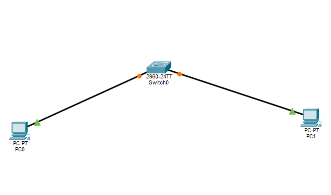

---

## 2. Creating the VLANs

I created two VLANs on the switch:

```text
VLAN 10 → students
VLAN 20 → staff
```

The VLANs were created using:

```text
enable
configure terminal
vlan 10
name STUDENTS
exit
vlan 20
name STAFF
exit
```

I then verified the configuration using:

```text
do show vlan brief
```

The switch showed both VLANs as active.

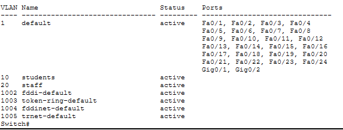

---

## 3. Configuring the PCs

I configured PC0 with:

```text
IP address: 192.168.10.10
Subnet mask: 255.255.255.0
```

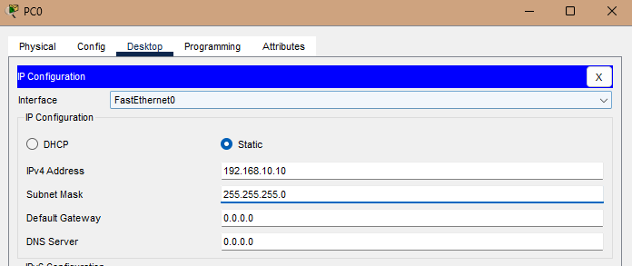

PC1 was configured with:

```text
IP address: 192.168.20.10
Subnet mask: 255.255.255.0
```

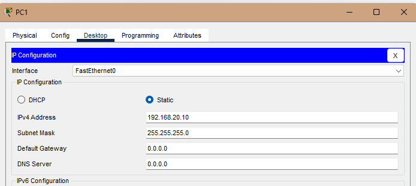

No default gateway was configured because this lab did not include a router.

---

## 4. Assigning Switch Ports

I configured the switch ports so that:

```text
Fa0/1 → VLAN 10
Fa0/2 → VLAN 20
```

The ports were configured as access ports:

```text
interface fastethernet 0/1
switchport mode access
switchport access vlan 10
exit

interface fastethernet 0/2
switchport mode access
switchport access vlan 20
exit
```

I then verified the port assignments with:

```text
show vlan brief
```

The output showed:

```text
10   students   active    Fa0/1
20   staff      active    Fa0/2
```

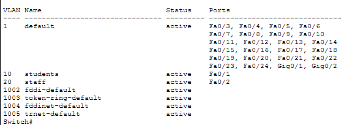

---

## 5. Testing VLAN Isolation

I tested connectivity from PC0 to PC1:

```text
ping 192.168.20.10
```

The ping failed.

PC0 was configured as:

```text
192.168.10.10/24
```

while PC1 was:

```text
192.168.20.10/24
```

The two PCs were also in different VLANs, and there was no router configured to provide inter-VLAN routing.

I also confirmed that PC0 could successfully ping its own address:

```text
ping 192.168.10.10
```

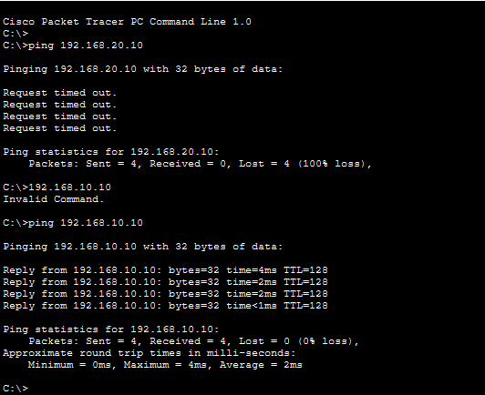

This established the expected baseline before introducing the troubleshooting fault.

---

## 6. Introducing a VLAN Misconfiguration

I deliberately changed the configuration of `Fa0/2`.

PC1 should have been connected to VLAN 20, but I changed the port to VLAN 10:

```text
interface fastethernet 0/2
switchport access vlan 10
```

The resulting configuration was:

```text
VLAN 10 → Fa0/1, Fa0/2
VLAN 20 → no assigned ports
```

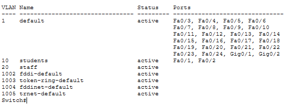

This created the configuration fault that I would then troubleshoot.

---

## 7. Diagnosing the Fault

I used the following command to investigate the configuration of `Fa0/2`:

```text
show interfaces fa0/2 switchport
```

The important output was:

```text
Access Mode VLAN: 10 (students)
```

Because `Fa0/2` was connected to PC1, this showed that the port was assigned to the wrong VLAN.

PC1 was supposed to be part of VLAN 20 (`staff`).

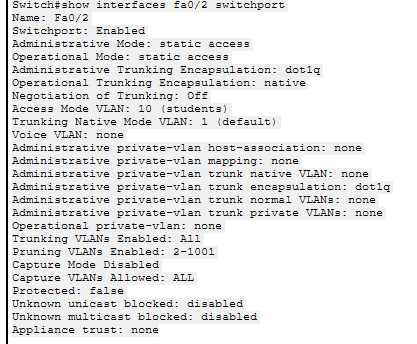

### Identified fault

The fault was:

> `Fa0/2` was assigned to VLAN 10 instead of VLAN 20.

---

## 8. Correcting the Fault

I corrected the configuration by assigning `Fa0/2` to VLAN 20:

```text
enable
configure terminal
interface fastethernet 0/2
switchport access vlan 20
exit
end
```

I then verified the VLAN configuration:

```text
show vlan brief
```

The corrected configuration showed:

```text
10   students   active    Fa0/1
20   staff      active    Fa0/2
```

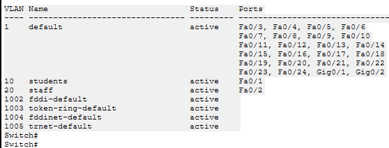

---

## 9. Adding a Second VLAN 20 Device

To properly test connectivity within VLAN 20, I added a third PC.

PC2 was configured with:

```text
IP address: 192.168.20.20
Subnet mask: 255.255.255.0
```

Its switch port, `Fa0/3`, was assigned to VLAN 20.

The resulting VLAN 20 configuration contained:

```text
Fa0/2 → PC1
Fa0/3 → PC2
```

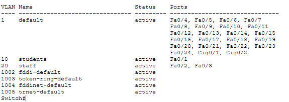

---

## 10. Testing the Corrected VLAN

From PC1, I tested connectivity to PC2:

```text
ping 192.168.20.20
```

The test was successful:

```text
Packets: Sent = 4, Received = 4, Lost = 0 (0% loss)
```

This demonstrated that the two devices in VLAN 20 and the same IP subnet could communicate successfully.

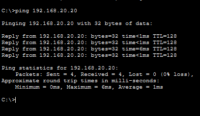

---

## 11. Final Configuration

Finally, I checked the switch configuration using:

```text
show vlan brief
```

The final configuration was:

```text
10   students   active    Fa0/1
20   staff      active    Fa0/2, Fa0/3
```

This confirmed that the switch ports were assigned to the intended VLANs.

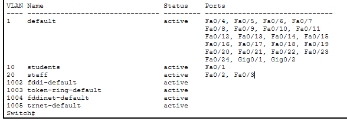

---

## Results

| Test / Check                              | Result     |
| ----------------------------------------- | ---------- |
| VLAN 10 created                           | Successful |
| VLAN 20 created                           | Successful |
| PC0 assigned to VLAN 10                   | Successful |
| PC1 assigned to VLAN 20                   | Successful |
| Incorrect VLAN assignment introduced      | Successful |
| Fault identified using switch diagnostics | Successful |
| Fault corrected                           | Successful |
| PC1 → PC2 connectivity                    | Successful |
| Final VLAN configuration verified         | Successful |

---

## What I Learned

This lab helped me understand how VLANs separate devices into different Layer 2 networks and how switch ports determine which VLAN an end device belongs to.

I also learned that troubleshooting should start with checking what is actually configured rather than immediately changing settings.

The `show vlan brief` command was useful for seeing which ports were assigned to each VLAN, while:

```text
show interfaces fa0/2 switchport
```

provided more detailed information about an individual switch port.

The main troubleshooting lesson was that a device can have a correctly configured IP address but still have a connectivity problem if its switch port is assigned to the wrong VLAN.

---

## Limitations

This was a small simulated network using Cisco Packet Tracer.

The lab did not include:

* A router or Layer 3 switch
* Inter-VLAN routing
* DHCP
* Trunk links
* Multiple physical switches

Because of this, communication between VLAN 10 and VLAN 20 was not expected.

---

## Future Improvements

I could extend this lab by:

* Adding a router-on-a-stick configuration.
* Creating a trunk between a switch and router.
* Testing inter-VLAN routing.
* Adding DHCP.
* Using multiple switches.
* Introducing additional configuration faults and troubleshooting them.

These are potential future improvements and were **not part of this lab**.
